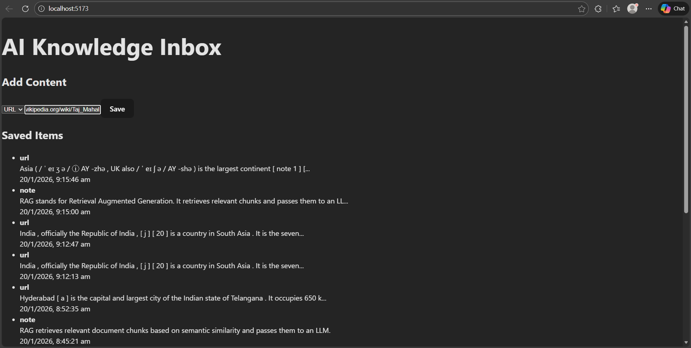

# AI Knowledge Inbox

A simple full-stack app to save notes or URLs and ask questions using an AI-powered search (RAG).
Focus: clarity, minimal UI, correct AI integration. Single user only.

## Features

- Add notes (plain text)
- Add URLs (content fetched backend-side)
- Store content with metadata
- Ask questions over saved content
- Get answers with cited sources

## Tech Stack

**Backend:** FastAPI, SQLite, OpenAI API  
**Frontend:** React (hooks), minimal UI

## How to Install & Run

git clone <repo-url>
cd ai-knowledge-inbox

Backend

cd backend
pip install -r requirements.txt
export OPENAI_API_KEY="your_api_key_here"   # or set in .env
uvicorn main:app --reload

Backend URL: http://localhost:8000

Frontend

cd frontend
npm install
npm run dev

Frontend URL: http://localhost:5173

##Frontend Flow

SC1 – Add Content

1. User enters a note or a URL
2. Clicks Save
3. Frontend sends request → POST /ingest
4. Backend:
    Fetches URL content (if provided)
    Cleans the text
    Chunks the content
    Generates embeddings
    Stores chunks with metadata
5. Saved items are displayed in a list:
    Shows type (note / URL)
    Shows timestamp
6. Data persists after refresh

SC2 – View Saved Items

1. User enters a question
2. Clicks Ask
3. Frontend sends request → POST /query
4. Backend:
    Embeds the user question
    Retrieves top-K relevant chunks
    Sends question + retrieved context to the LLM
    Generates a final answer
5. Frontend displays:
    LLM-generated answer
    Source chunks with similarity scores

#Ask a Question

1. Enter a question in the input box.
2. Click Ask → frontend sends POST /query to backend.
3. Backend retrieves top chunks and returns answer + source snippets.
4. Answer and sources are displayed in the frontend.

API Overview
POST /ingest → Add note or URL
GET /items → List saved items
POST /query → Ask a question

Notes
Embeddings are generated at ingest time
Easy to debug and extend
No overengineering
